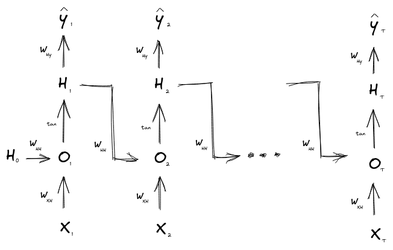

# Architectures

## RNN

Applications
- language modelling
- sequence tagging: POS, NER
- sentiment classification
- encoding: question answering, machine translation
- decoding: speech recognition, transation, summarization

Issues
- Vanishing and exploding gradients

## Gated units (LSTM, GRU)

Gated units address the vanishing gradient problem by adding 'direct' connections between the RNN units.

### LSTM

On step $t$, there is a hidden state $h^t$ and a cell state $c^t$:
- Both are vectors of length $n$
- The cell stores long-term information
- The LSTM can read, erase, and write information from the cell
- Dialogue
- Parsing
- Text generation (e.g. code, music)

## Seq-to-seq with RNN

When doing seq-to-seq with RNN the sparse representation of the input created by the encoder is the hidden state of the model at the last step of the input feed-forward pass.

The decoder starts with this hidden state and the `<START>` token to produce the output.

During training of the decoder, a *teacher-forcing* method is often used. That is, the correct input of the decoded sentence is fed at each step of the feed-forward pass.

## Seq-2-seq with attention

An issue with vanilla seq-2-seq achitectures is that the last hidden state of the encoder needs to capture all the information about the source sentence; this can be seen an information bottleneck.

Attention models aim at reducing this issue by adding a connection between the decoder and the hidden states of each of the encoder steps. This modificaiton allows the NN to focus on a particular part of the source sequence.

For each step $t$ in the decoder, attention models generate a score that captures the similarity between the hidden state at that step and each of the hiddens states in the encoder model.

Then, a probability distribution is derived from these scores via a softmax actiation function. This probability distribution is then used to create a weighted average of the hidden states of the encoder model. 

The result of the weighted average is then combined with the hidden state of the decoder model and finally processed via an activation function.

### Intuition

Attention models involve a set of *values* (the hidden states of the encoder) and a query (the hidden state of the decoder model).

Attention modes then:
- compute the attention scores, which capture a measure of similarity/relevance between the query and the values
- Derive a probability distribution - the *attention distribution* from the attention scores
- Use the attention distribution to compute a weighted average of the values, the so called *attention output* or *context vector*
- Combine the query with the context vector to generate the decoder output

The attention output is then a selective summary of the information contained in the values, where the query determines which values to focus on. 

Attention is then a way to obtain a fixed-size representation of an arbitrary set of representations - the values - dependent on some other representation - the query.

### Variants

Ways to derive the attention scores:
- basic dot product: $e_i = s^T h_i$. This assumes that the query and the values have the same dimention.
- multiplicative attention: $e_i = s^T W h_i$, with $W$ a weight matrix
- Reduced rank multiplicative attention: $W = U^T V$, with $U$, $V$ "skinny" matrices; this reduces the number of parameters of $W$
- additive attention: $e_i = v^T tanh(W_1 h_i + W_2 s)$, which effectively uses a dense NN layer to compute the scores

## Seq-2-seq with self-attention

Issues with recurrent seq-2-seq models:
- linear interaction distance
- lack of parallelizability

Attention operates on:
- queries
- keys
- values

In self-attention, the queries, keys, and values are drawn from the same source - the hidden states at a given layer of the model.

Self-attention operates as follows:
- Compute the key-query affinities: $eij = q_i^T k_j$
- Compute the attention weights $a_{ij}$ from the affinities (with softmax)
- Compute the output: $\sum_{j}{a_{ij}v_j}$

### Issues: Sequence order

Need to encode the order in the k, q, v

**Sinusoids**
- periodicity indicates that absolute position is not that important
- can extrapolate to longer sequences
- weigths cannot be learned

**Learned**: a matrix $P$ with learnabl parameters
-  each position gets to be learned to fit the data
-  Can't extrapolate to indices outside $T$

### Issues: lack of non-linearity

There are not elementwise nonlinearities in self-attention; stacing more self-attention layers just re-averages value vectors

**Fix**: add a feed-forward network to post-process each output vector

### Issues: masking the future

Important for decoders

At every timestep, mask out attention to future words by setting non-admissible attention scores to $- \infty$

## Transformers

### Key-query-value attention

Let $x_1, \cdots, x_T$ be input vectors to the Transformer encoder, with $x_i \in \mathbb{R}^d$

The keys, queries, and values are:
- $k_i = K x_i$, with $K$ a $d \times d$ matrix
- $q_i = Q x_i$, with $Q$ a $d \times d$ matrix
- $v_i = V x_i$, with $V$ a $d \times d$ matrix

The output are defined as:
$softmax(XQ(XK)^T) \cdot XV \in \mathbb{R}^{T \times d}$

### Multi-headed attention

Use $L$ $K_l$, $Q_l$, $V_l$ matrices that act independently on the inputs and compute different attention scores.

The output of each head is $T \times \frac{d}{L}$ dimension.

Concatenate the $L$ outputs to get a $T \times d$ matrix.

### Tricks to help with training

####  Residual connections

$X_i = X_{i-1} + Layer(X_{i-1})$

####  Layer normalization

Cut down on uninormative variation in hidden vector values by normalizing to unit mean and standard deviation within each layer.

### Issues

#### Quadratic compute in self-attention

Computing all pairs of interactions means out computation grows quadratically with the sequence length

Approaches:
- Linformers

#### Position representation

- Relative linear position attention (Shaw et al 2018)
- Dependency syntax-based position (Wang et al 2019)

####  Scaling the dot product